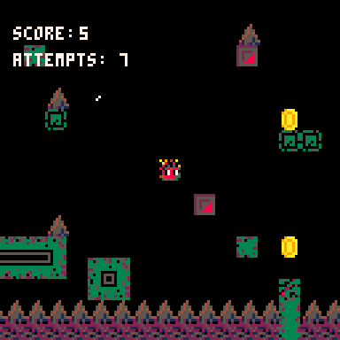

# PicoDash Pico-8
> Totally inspired by one of my favorite childhood games, Geometry Dash. I tried to recreate some basic aspects of it using the Pico-8 software. It's not much, but I did it with love.

Play here: [_PicoDash_](https://frankoatr.github.io/PicoDash-Pico-8/).
Jump with Z...

## Table of Contents
* [General Info](#general-information)
* [Technologies Used](#technologies-used)
* [Features](#features)
* [Preview](#preview)
* [Setup](#setup)
* [Usage](#usage)
* [Project Status](#project-status)
* [Room for Improvement](#room-for-improvement)
* [Acknowledgements](#acknowledgements)
* [Contact](#contact)

## General Information
- Development date: September – October 2023.
- This is a small project that I did in my free time while attending university.

## Technologies Used
- PICO-8 - version 0.2.5g

## Features
- 4 player skins
- 1 unique level to complete

## Preview

## Setup
To play you just have to access the link that I provided you at the beginning.
You only need a browser of your choice to play.

## Usage
If you want to compile it yourself, feel free to use and modify the picodash.p8.png file; To do this you will need to drag the file into the pico-8 software

## Project Status
Project is: _complete_

## Improvements
- There are problems with player collisions, but they rarely appear.

## Acknowledgements
- This project was inspired by Geometry Dash from RobTop
- Dedicated to all the people who inspire me to develop games.

## Contact
Created by Francisco Rosa.
<a href="mailto:francoatr2015@gmail.com">francoatr2015@gmail.com</a> - Don't worry, I'm friendly!
